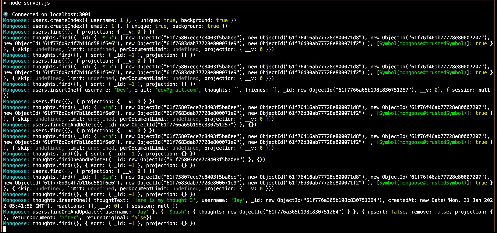

# 18-Social-Network-API

## Description

This is a API application for a social network that uses a NoSQL database which allows the website which can handle large amounts of unstructured datawhere 

This web application helps the user share their thoughts,react to friend's thoughts, and create a friend list.

## Screenshot of the Command line

## Installation

On the terminal type "npm install" to install the dependencies.
and type "npm start" to execute the application.

## Technologies Used

* Javascript
* Node.js
* Express.js
* Mongoose
* MongoDB

## Walkthrough Video

https://watch.screencastify.com/v/TAgwkj1ipIm5uTlGmo2D

## Questions

If you have any questions about the project, contact me at akhilasrinagula@gmail.com

